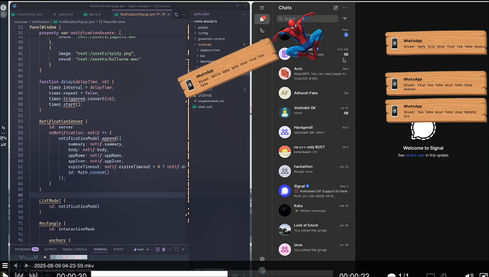
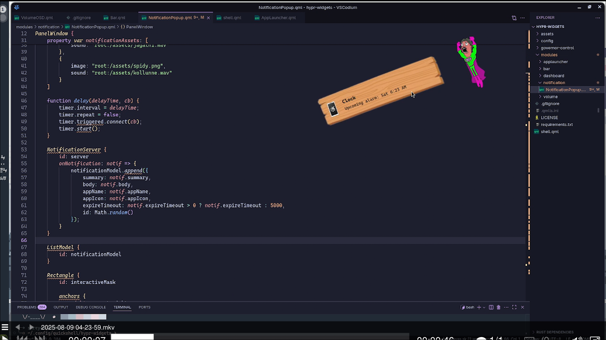

# Silly-Notifs 🎯


## Basic Details
### Team Name: Fulgur Code


### Team Members
- Member 1: Nived C K ,LBS College of Engineering
- Member 2: Shreyas S K ,LBS College of Engineering


### Project Description
A desktop notification system that's more distracting than helpful. Get ready for a barrage of hilarious, and frankly, useless notifications , which having  funny Malayalam dialogues that will make you question your life choices.

### The Problem (that doesn't exist)
In a world of constant productivity and focus, we've identified a critical lack of meaningless distractions. Who needs important alerts when you can have a screaming goat on your screen?

### The Solution (that nobody asked for)
We've engineered a state-of-the-art notification system that throws all semblance of productivity out the window. It's designed to be as intrusive and silly as possible, because why not?

## Technical Details
### Technologies/Components Used
For Software:
-  Qt
- QML
- VS Codium , Git , Neovim , Helix


### Implementation
For Software:
# Installation

**Arch Linux**

```bash
sudo pacman -S cpupower
```

**Other Distributions (Debian/Ubuntu-based)**

```bash
sudo apt-get install linux-tools-common
```

**Build and Install `governor-control`**

```bash
cd governor-control
./install.sh
```

# Run

```bash
quickshell -s shell.qml
```

### Project Documentation
For Software:

# Screenshots (Add at least 3)








# Video


## Team Contributions
- Nived C K: Programming
- Shreyas S K: Programming


---
Made with ❤️ at TinkerHub Useless Projects


